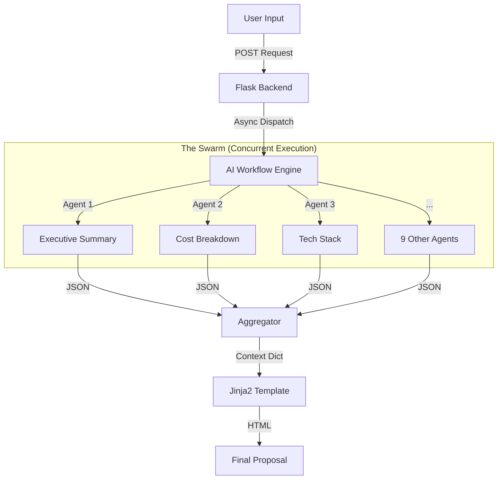

Here is a professional, developer-ready `README.md` based on the code you provided. It highlights the architecture, the async capabilities, and provides clear setup instructions.

```markdown
# BidBuilder AI 🚀

**The High-Performance Automated RFP Response Architect.**

BidBuilder AI is a full-stack application that generates comprehensive, enterprise-grade business proposals in seconds. Unlike standard chatbots that generate text sequentially, BidBuilder utilizes a **Parallel Agent Architecture** to orchestrate 12 specialized AI agents simultaneously, reducing document generation time by over 70%.

---

## ⚡ Key Features

* **Parallel Orchestration:** Uses Python's `asyncio` to fire 12 independent AI prompts at once, cutting generation time from ~60s to ~15s.
* **Structured Output:** Generates a complete 12-section document including Executive Summaries, Gantt Charts, Cost Breakdowns, and Risk Matrices.
* **Strict JSON Enforcement:** AI agents are prompted to return strict JSON to ensure consistent rendering in the UI.
* **Print-Ready UI:** Custom CSS optimized for web viewing and one-click PDF export via the browser's print engine.
* **Context-Aware:** Adapts content based on Client Industry, Budget, Tech Preferences, and desired Tone.

---

## 🏗 System Architecture




---

## 🛠 Tech Stack

* **Backend:** Python 3.10+, Flask
* **Concurrency:** `asyncio`, `aiohttp` (via Groq client)
* **AI Inference:** Groq API (Llama-3 / Mixtral models)
* **Frontend:** HTML5, CSS3, Jinja2 Templating
* **Styling:** Custom CSS with Print Media Queries

---

## 📂 Project Structure

```bash
BidBuilder/
├── app.py                     # Application entry point
├── requirements.txt           # Python dependencies
├── .env                       # Environment variables (API Keys)
├── application/
│   ├── __init__.py            # Flask App Factory
│   └── controllers.py         # Route logic and Async runners
├── ai_workflow/
│   ├── prompts.py             # prompt engineering for 12 specific agents
│   └── utils.py               # Async engine & API handling
├── templates/
│   ├── index.html             # Input Form
│   └── proposal.html          # Final Report Template
└── output/                    # JSON logs of generated proposals

```

---

## 🚀 Getting Started

### Prerequisites

* Python 3.8 or higher
* A Groq API Key (Get one at [console.groq.com](https://console.groq.com))

### Installation

1. **Clone the repository**
```bash
git clone [https://github.com/yourusername/bidbuilder-ai.git](https://github.com/yourusername/bidbuilder-ai.git)
cd bidbuilder-ai

```


2. **Create a Virtual Environment**
```bash
python -m venv venv
# Windows
venv\Scripts\activate
# Mac/Linux
source venv/bin/activate

```


3. **Install Dependencies**
```bash
pip install -r requirements.txt

```


4. **Configure Environment**
Create a `.env` file in the root directory:
```bash
touch .env

```


Add your API key (Note: Variable name must match `utils.py`):
```env
GROK_API_KEY=gsk_your_actual_api_key_here

```


5. **Run the Application**
```bash
python app.py

```


6. **Access the App**
Open your browser and navigate to `http://localhost:8000`

---

## 📖 Usage Guide

1. **Fill the Hub:** Enter the client details, project goals, timeline, and budget in the input form.
2. **Select Tone:** Choose between Formal, Innovative, or Technical to guide the AI's writing style.
3. **Generate:** Click "Generate Proposal." The spinner indicates the backend is processing 12 streams of data.
4. **Review:** The result is a formatted HTML report.
5. **Export:** Click the "Print" button at the bottom of the page. In the print dialog, select **"Save as PDF"** to create a shareable file.

---

## 🔧 Configuration & Tuning

### Adjusting the Model

To change the AI model (e.g., to Llama-3-70b), edit `ai_workflow/utils.py`:

```python
MODEL = "llama3-70b-8192" # or "mixtral-8x7b-32768"

```

### Concurrency & Retries

If you hit rate limits, you can adjust the retry logic in `ai_workflow/utils.py`:

```python
MAX_RETRIES = 5
# You can also implement a Semaphore if needed for lower tier keys

```

---

## 🤝 Contributing

1. Fork the repository
2. Create your feature branch (`git checkout -b feature/AmazingFeature`)
3. Commit your changes (`git commit -m 'Add some AmazingFeature'`)
4. Push to the branch (`git push origin feature/AmazingFeature`)
5. Open a Pull Request

---

## 📄 License

Distributed under the MIT License. See `LICENSE` for more information.

```

```
